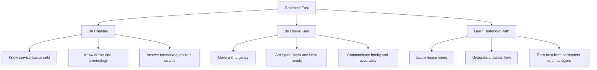

# Nashville Hospitality Ramp-Up Playbook

## Purpose
This is a fast-learning coaching memo for an intelligent newcomer targeting:
- `Barback`
- `Food Runner`
- `Server Assistant`
- eventual `Bartender`

The goal is not to make you pretend you already know the job. The goal is to make you dangerous fast, credible in interviews, and useful on a high-volume Nashville floor.

## How To Use This
Study this in order:
1. role fundamentals
2. drink and service knowledge
3. floor awareness rules
4. interview and quiz prep
5. 7-day sprint plan

Do not try to memorize everything at once. Build fluency in layers.

## Nashville Reality
High-volume Nashville service usually rewards:
- speed
- stamina
- clean communication
- anticipation
- consistency under pressure
- coachability

It does **not** reward:
- talking too much
- needing constant direction
- moving slowly with urgency theater
- getting flustered
- acting like you are already a bartender when you are not

In a lot of high-volume rooms, especially downtown, the first question is not "Are you cool?"
It is "Do you make service easier or harder?"

## Readiness Checklist

### Tennessee server-permit awareness
If you are serving or selling alcohol for on-premise consumption at a TABC-licensed establishment, you need a Tennessee server permit.

Key points from the Tennessee Alcoholic Beverage Commission:
- minimum age is `18`
- you must complete a `TABC-certified alcohol awareness program`
- new servers have a `61-day grace period` from original hire date to complete requirements and obtain the permit
- the application fee is listed as `$20`
- you are required to have a copy of your permit on you while working, electronic is acceptable if accessible

Important note:
- TABC's `Server Permit` page says permits issued on or after `January 1, 2025` are valid for `2 years`
- TABC's FAQ page still says `5 years`
- treat the main server-permit page as the safer source and verify in RLPS when applying

Official sources:
- [TABC Server Permit](https://www.tn.gov/abc/permitting/server.html)
- [TABC Server Permit FAQ](https://www.tn.gov/abc/public-information-and-forms/frequently-asked-questions.html)

### What to have ready before interviews
- black non-slip shoes
- black belt
- black socks
- black pants or dark jeans if the house allows
- plain black tee or button-down for staging if asked
- small notebook
- pen
- phone notes with drinks and terminology
- server-permit plan, either already started or ready to start immediately

## Priority Map

## 1. What A Barback Must Know Cold

### Core job
Your job is to keep bartenders from stopping.

You are not there to look busy. You are there to remove friction:
- no empty ice
- no empty beer wells
- no missing glassware
- no dead garnish station
- no sticky bar top staying sticky
- no trash overflow
- no keg emergency that surprises the team

### The barback mental model
Every 5 to 10 minutes, scan:
1. ice
2. beer
3. liquor backstock
4. glassware
5. garnish
6. trash
7. spills
8. empty bottles
9. bartender stress level

If any of those are drifting, fix them before anyone asks.

### Barback knowledge checklist
- layout of the bar
- where all backup liquor lives
- where beer, wine, NA beverages, cups, straws, napkins, garnishes, towels, chemicals, and trash liners live
- par levels for each major item
- how to change a keg
- how to spot a kicked keg fast
- how to restock without blocking guests or bartenders
- how to bus glassware without breaking flow
- how to handle broken glass safely
- how to wipe and reset surfaces fast
- how to carry ice, cases, racks, and bins safely
- where the mop bucket and spill kit live
- how to call out low stock briefly
- house rules on IDs, over-service escalation, comps, and manager calls

### What “good” looks like
- bartender never has to ask twice
- you refill before “out” becomes “problem”
- you stay out of the guest’s way
- your hands are always doing the next useful thing
- you communicate in short bursts
- you do not disappear

### Barback phrases to use
- "Ice is topped."
- "Two backup Tito's under."
- "Keg is close, I’m swapping next."
- "Glassware is back up."
- "Need a manager for a spill at service well."

### What gets barbacks trusted fast
- punctuality
- physical pace
- calm under volume
- never arguing with bartenders
- remembering each bartender's preferences
- stocking the exact items each station burns through

## 2. What A Food Runner / Server Assistant Must Know Cold

### Core job
Your job is to keep tables moving and help the server protect guest experience.

### Food runner priorities
- know seat numbers
- know table numbers
- know the menu enough to announce dishes correctly
- know modifiers and allergies
- know which items need to hit fast
- know what should never die in the window

### Server assistant priorities
- water service
- pre-bussing
- clearing
- resetting
- bread service if applicable
- helping pace the table without disrupting the server
- watching for silent guest needs

### Menu knowledge checklist
- every entree name
- major protein in each dish
- obvious allergens
- major sides and sauces
- which dishes are shareable
- what comes hot, fast, cold, delayed, or with special handling

### Seat-number discipline
If a house uses seat numbers and you cannot run to correct seats cleanly, you become a problem.

Learn:
- how the house numbers seats
- how to approach the table
- how to sell confidence without guessing

Never ask:
- "Who had the burger?"

Instead:
- know it
- confirm lightly only if needed
- use the server or expo if unclear before leaving the window

### Food runner / server assistant scan cycle
Each pass through the floor, check:
1. dirty plates
2. empty glasses
3. low water
4. full hands in or out
5. tables that need reset
6. guests looking around for help
7. expo window backing up

### What “good” looks like
- no wandering
- no empty-handed trips
- no mystery food drops
- no dead tables waiting to be cleared
- no guest needing to flag someone down for basics

## 3. Top 20 Drinks / Builds To Memorize First

### Rule first
Memorize the structure, not just the name. House specs vary.

Know for each:
- base spirit
- main modifiers
- method: build, shake, stir
- glass
- garnish

### Priority 20

| Priority | Drink | Know This Cold |
|---|---|---|
| 1 | Tito's Soda | vodka, soda, lime, rocks |
| 2 | Jack & Coke | whiskey, cola, rocks |
| 3 | Whiskey Ginger | whiskey, ginger ale or beer, lime optional |
| 4 | Vodka Cranberry | vodka, cranberry, lime optional |
| 5 | Gin & Tonic | gin, tonic, lime |
| 6 | Rum & Coke | rum, cola, lime optional |
| 7 | Tequila Soda | tequila, soda, lime |
| 8 | Ranch Water | tequila, lime, sparkling mineral water |
| 9 | Moscow Mule | vodka, lime, ginger beer |
| 10 | Margarita | tequila, orange liqueur, lime, shake, salt optional |
| 11 | Old Fashioned | bourbon or rye, sugar or simple, bitters, rocks, orange peel |
| 12 | Manhattan | whiskey, sweet vermouth, bitters, stirred, cherry |
| 13 | Martini | gin or vodka, dry vermouth, stirred, olive or twist |
| 14 | Espresso Martini | vodka, coffee liqueur, espresso, shaken |
| 15 | Lemon Drop | vodka, lemon, orange liqueur, simple, sugar rim optional |
| 16 | Whiskey Sour | whiskey, lemon, simple, egg white optional by house |
| 17 | Mojito | rum, lime, mint, sugar or simple, soda |
| 18 | Negroni | gin, Campari, sweet vermouth, stirred |
| 19 | Bloody Mary | vodka, bloody mix, seasoning, garnish varies |
| 20 | Mimosa | sparkling wine, orange juice |

### Bonus fast-volume shots to know
- Green Tea Shot
- Lemon Drop Shot
- Kamikaze
- Vegas Bomb

### Build shorthand examples

| Drink | Baseline Build Pattern |
|---|---|
| Margarita | tequila + orange liqueur + lime |
| Old Fashioned | whiskey + sugar + bitters |
| Martini | spirit + dry vermouth |
| Negroni | gin + Campari + sweet vermouth, equal parts baseline |
| Mule | spirit + lime + ginger beer |
| Sour | spirit + lemon + sweetener |

## 4. Spirits, Beer, Wine, And Service Basics

### Spirits basics
Know the major categories and a few common calls in each.

#### Whiskey
- bourbon
- rye
- Tennessee whiskey
- Irish whiskey
- Scotch

Common calls:
- Jack Daniel's
- Jameson
- Maker's Mark
- Bulleit
- Woodford Reserve
- Crown Royal

Know:
- bourbon is sweeter, corn-driven
- rye is spicier
- "neat" means straight, no ice
- "rocks" means over ice
- "up" means chilled and strained, no ice in glass

#### Vodka
Common calls:
- Tito's
- Grey Goose
- Ketel One

#### Tequila
- blanco
- reposado
- anejo

Common calls:
- Casamigos
- Patron
- Don Julio
- Espolon

Know:
- blanco is cleaner and brighter
- reposado has barrel aging and more warmth

#### Gin
Common calls:
- Tanqueray
- Hendrick's
- Bombay Sapphire

Know:
- gin is juniper-forward
- guests often care whether it is standard or more botanical

#### Rum
- light
- dark
- spiced
- coconut

Common calls:
- Bacardi
- Captain Morgan
- Malibu

### Beer basics
You do not need cicerone-level knowledge fast.
You do need:
- draft vs bottle vs can
- lager vs IPA vs wheat vs stout
- which beers are domestic, local, or craft
- how to identify a kicked keg
- how to pour draft with minimal foam if asked later

If you are on Broadway or in a high-volume bar, learn:
- top 10 draft handles
- top-selling domestics
- top-selling light beers
- top-selling local

### Wine basics
Learn the serviceable basics first:
- cabernet sauvignon = fuller red
- pinot noir = lighter red
- sauvignon blanc = crisp white
- chardonnay = fuller white
- pinot grigio = lighter white
- prosecco / sparkling = bubbly

Know:
- red vs white serving basics
- by-the-glass list
- house sparkling option
- which glasses are used for each category

### Non-alcoholic and mocktail basics
This matters more than many newcomers think.

Know:
- soda family
- tonic vs soda vs ginger beer
- lemonade
- iced tea
- coffee basics if restaurant-brunch environment
- easiest mocktail structure: citrus + sweetener + sparkling + garnish

## 5. Body Language And Floor Awareness Rules

### The floor-awareness framework
Use `Eyes, Hands, Feet, Ears`.

#### Eyes
Always scan:
- low glasses
- dirty plates
- low ice
- full trash
- backed-up expo
- guests searching the room
- bartenders moving faster than support can keep up

#### Hands
Hands should almost never be idle.

Rules:
- full hands in
- full hands out
- if one hand is empty, there should be a reason

#### Feet
Move fast, not frantic.

Rules:
- no stopping in choke points
- no backing into people
- no slow wandering
- take the shortest clean route

#### Ears
Listen for:
- "86"
- "hands"
- "runner"
- "hot"
- "behind"
- "corner"
- "glass"
- "bar needs ice"

### Body-language rules
- shoulders open
- chin up
- face neutral to positive
- no eye-rolling
- no visible panic
- no slumped walking
- no crossed arms
- no leaning on host stands, walls, or service stations

### Vocabulary you must use
- behind
- corner
- hot
- sharp
- heard
- on it
- coming down
- 86

### Best response language
Say:
- "Heard."
- "On it."
- "Running now."
- "Need seat 3 confirmed."

Do not say:
- "Yeah, yeah."
- "I know."
- "One second" when you mean 30 seconds
- "Somebody already told me"

## 6. Interview And On-The-Spot Quiz Prep

### What managers want to believe
They do not need you to be polished. They need you to be low-risk.

You need to make them believe:
1. you will show up
2. you can handle pace
3. you take direction
4. you will not create drama
5. you can learn fast

### Best positioning
Use:
- physically strong
- fast learner
- calm under pressure
- comfortable with demanding people
- used to restocking, operations, customer service, opening and closing
- motivated to start in support and earn trust

### How to talk about cocktail knowledge
Say:
> I’m not claiming pro bartending experience, but I am already comfortable with common spirits, classic builds, and learning recipes quickly. My wife has industry experience, and we make cocktails and mocktails at home often, so I’m coming in with a real base, not pretending to know everything.

### Questions you may get

#### Why hospitality now?
Good answer:
> I want work that is more immediate, team-based, and grounded in execution. I’m comfortable with pace, support work, and customer-facing pressure, and I’m serious about earning my way in.

#### Why barback / food runner / server assistant?
Good answer:
> I want to get into the right house, prove myself, and become useful fast. Support roles are the best place to do that.

#### Can you handle nights and weekends?
Good answer:
> Yes. I’m fully available and I understand the money is usually tied to peak shifts.

#### What do you know about cocktails?
Good answer:
> I know the core structures and a number of classic builds already, and I’m confident I can pick up house specs fast.

### Likely on-the-spot quiz areas
- difference between bourbon and rye
- neat vs rocks vs up
- what goes in a margarita
- what goes in an old fashioned
- what goes in a martini
- what a ranch water is
- common whiskey and tequila calls
- what “86” means
- how you carry plates or glass racks

### Drill questions
- Name the three ingredients in a classic margarita.
- What is the difference between a Manhattan and an Old Fashioned?
- What does a guest mean by Tito's up with a twist?
- What do you do when a keg kicks during a rush?
- What do you do if you are unsure which seat gets the salmon?
- What are the first three things you scan walking behind the bar?

## 7. Seven-Day Accelerated Study Plan

### Day 1, role map and terminology
- read this full memo once
- learn bar vocabulary
- learn floor vocabulary
- watch 30 to 45 minutes of barback and food-runner videos from credible operators
- make flashcards for `behind`, `corner`, `hot`, `heard`, `86`, `neat`, `rocks`, `up`

### Day 2, drink foundations
- memorize priority drinks `1-10`
- practice saying each build out loud
- have your wife quiz you cold
- do 20 rapid-fire reps
- learn glass and garnish for each

### Day 3, classics and calls
- memorize priority drinks `11-20`
- learn common whiskey, vodka, tequila, gin, rum calls
- practice differentiating bourbon, rye, blanco, reposado, tonic, soda, ginger beer

### Day 4, service mechanics
- practice tray carry if possible
- practice carrying multiple glasses safely
- rehearse seat-number awareness with a fake table map
- practice announcing dishes cleanly
- drill full-hands in, full-hands out mindset

### Day 5, barback systems day
- learn keg basics
- learn how ice flow works
- learn par-level thinking
- set up a fake bar station at home and practice restock logic
- drill “scan cycle” every 5 minutes

### Day 6, mock service shift
- do a 60-minute mock service session
- wife plays bartender or demanding server
- you respond only with service language
- simulate tickets, low stock, glass runs, water refills, and guest interruptions

### Day 7, interview and walk-in prep
- rehearse your 30-second intro
- rehearse answers to 10 common questions
- run a drink quiz
- confirm your wardrobe
- confirm server-permit plan
- print resumes only after copy is approved

## 8. Mistakes That Get New Hires Cut Fast

### Barback mistakes
- disappearing during a rush
- letting ice run out
- not checking beer and liquor backups
- restocking the wrong items while obvious needs are burning
- acting annoyed at bartender requests
- moving slowly with no awareness
- failing to communicate when you do not know something

### Food runner / server assistant mistakes
- auctioning food
- wrong seats
- ignoring allergens or modifiers
- walking empty-handed
- not pre-bussing
- hovering instead of moving
- failing to read table needs

### Universal mistakes
- late
- dirty shoes or sloppy presentation
- phone out on shift
- talking more than listening
- visible ego
- defensiveness
- gossip
- freezing when corrected

## What Matters Most In Nashville High-Volume Environments

### If you want cash quickly
You need:
- nights
- weekends
- speed
- stamina
- high-volume tolerance

### If you want bartender progression
You need:
- to become the support person bartenders ask for by name
- to learn the house menu and house specs
- to earn trust before asking for promotion
- to prove reliability first, personality second

### What to ask in interviews
- What do support staff usually make on weekdays versus weekends?
- How are barbacks or server assistants assigned to stations or floors?
- What does success in this role look like in the first 30 days?
- What is the usual path and timing for someone strong to move up?

## First-Week Performance Standards

### Your target behavior
- arrive `10-15 minutes early`
- move like you mean it
- ask smart questions once
- remember the answer
- write things down
- do not need the same correction twice

### Your target reputation
By the end of week one, the team should say:
- "He works hard."
- "He learns fast."
- "He’s not in the way."
- "He notices things."
- "He doesn’t get rattled."

## Final Coaching Rules
1. Do not fake bartender experience.
2. Do not undersell your learning speed and discipline.
3. Support roles are won by reliability, not charisma.
4. In high-volume rooms, anticipation beats effort theater.
5. If you get hired, learn the house before trying to impress the house.

## What To Build Next
After reviewing this playbook, the next useful assets are:
- a one-page `barback interview sheet`
- a one-page `food runner / server assistant quiz sheet`
- a `bartender fundamentals cheat sheet`
- then the hospitality resume copy overhaul
