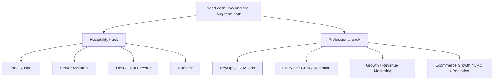

# Job Lane Map

## Objective
Build a two-track job search around eight lanes: four hospitality lanes for immediate cash flow and four professional lanes aligned to Matt Dimock's strongest long-term fit.

## Orchestration
- Mode: `expanded`
- Lead role: `strategist`, active now
- Support roles: `research lead`, `copy lead`, `operations lead`, `risk lead`, active now
- Core framework: `JTBD`
- Supporting frameworks: `Expected Value`, `Inversion + Premortem`

## Why this set fits the task
- `Strategist` selects the right lanes instead of over-indexing on one anecdote.
- `Research lead` verifies current pay, lane density, and role quality.
- `Copy lead` keeps the resume and pitch credible across very different hiring audiences.
- `Operations lead` keeps the search executable this week, not theoretical.
- `Risk lead` blocks overqualification, weak pivots, and misleading claims.

## Hospitality Lanes

| Rank | Lane | Why recommend it | Current evidence |
|---|---|---|---|
| 1 | Food Runner | Best mix of pay, accessibility, and venue quality. | Boqueria at `$25-$40/hr`, Luogo / Pelato at `$25-$30/hr`, Martin's at `$20-$25/hr`. |
| 2 | Server Assistant | Broadest lane with strong downside protection and good move-up path. | Capital Grille at `$700-$1,200/week`, TC Restaurant Group at `$12-$35/hr`, Culaccino at `$18-$22/hr`. |
| 3 | Host / Door Greeter | Cleanest immediate story, strong hiring odds, good hourly floor. | Nudie's at `$19-$20/hr`, JBJ's at `$18-$24/hr`, The Finch at `$20-$28/hr`. |
| 4 | Barback | Worth pursuing, but selectively and only in stronger houses. | Friends In Low Places at `$28-$35/hr`, Sushi-san at `$20-$26/hr`, Waymore's at `$17-$18/hr`. |

## Professional Lanes

| Rank | Lane | Why recommend it | Current evidence |
|---|---|---|---|
| 1 | Revenue Operations / GTM Operations | Strongest fit to Matt's operating-system, CRM, reporting, handoff, and enablement background. | Tithely Director of Revenue Operations at `$160K-$180K`, Momentus Senior Director of Revenue Operations at `$130K-$180K`, VITL Director of Revenue Operations at `$100K-$130K`. |
| 2 | Lifecycle / CRM / Retention | Strong fit to retention systems, segmentation, onboarding, and cross-functional customer journey ownership. | Bob's Watches CRM and lifecycle proof, Prosper lifecycle systems for `600K+` customers, OC Ramps owned-channel and retention relevance. |
| 3 | Growth / Revenue Marketing | Strong when the role values measurable pipeline, experimentation, CRO, automation, and reporting over pure brand. | Strong proof from Bob's Watches, Affordable Insurance Quotes, and OC Ramps, with current market demand for systems-heavy growth operators. |
| 4 | Ecommerce Growth / CRO / Retention | High-upside lane backed by OC Ramps and Bob's Watches proof. | Fewer local openings, but strongest proof for ecommerce growth, owned-channel lift, CRO, lifecycle, and site experience. |

## Decision Diagram

## How to use this
1. Apply immediately to the hospitality lanes this week.
2. Keep the professional lanes active in parallel, with higher selectivity and higher compensation floor.
3. Use lane-specific resumes instead of one generic resume.

## Risks
- Barback can look attractive on paper while hiding weak base pay and unclear tip-out.
- Host and door roles can become dead-end roles if the venue lacks mobility.
- RevOps and Lifecycle / CRM are the best long-term fits, but they will not produce cash as fast as hospitality.
- A generic resume will fail in both hospitality and professional lanes.
