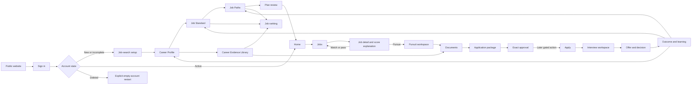

# Way Ahead Career OS: Customer Journey, Screen-State Architecture, and Critical Path

**Status:** Governing correction
**Effective:** 2026-07-23
**Owner:** Accountable CEO under Matt Dimock's Board authority
**Supersedes:** Customer-facing “move” language; Today as the product concept; lifecycle-only onboarding completion; owner controls in customer screens; System theme; one-role/raw-text profile review as a sufficient Career Profile; and broad programmatic acquisition before value proof
**Preserves:** The selected Executive Evidence visual language; public website; ChatGPT SSO; D1-backed tenant records; Career Profile, Job Standard, job scoring, Pursuits, Resume Studio, Cover Letter Studio, exact external-action gates, provenance, correction, and versioning

## Board decision

Keep the visual system. Rebuild the authenticated product around one literal job-search journey:

> **Understand → Set Up → Find → Decide → Prepare → Approve → Apply → Interview → Choose → Learn**

Way Ahead should help a person find the best next job with the least wasted effort, then build the strongest truthful case for that exact job. “Career OS” means the system owns the connected record and workflow, not that every possible career feature ships before alpha learning.

The public promise is:

> **Way Ahead learns what you are good at and what your next job must deliver, finds current jobs worth pursuing, and helps you build the strongest truthful application for each one.**

## Strategy-system map

The strategy library will converge on ten evergreen modules. Existing dated chapters remain decision history and evidence.

| Canonical module | Owns |
|---|---|
| 00 Strategy Index | North Star, current decisions, authority, and library routing |
| 01 Customer and Market Evidence | Segments, triggers, alternatives, competitors, and demand |
| 02 Brand, Positioning, and Offer | Promise, vocabulary, offer ladder, and comprehension |
| 03 Audience and JTBD | Search modes, emotional context, customer questions, and moments of truth |
| 04 Customer Journey and Service Blueprint | End-to-end journey, system work, handoffs, and approval boundaries |
| 05 Product IA and Screen-State Architecture | Routes, navigation, screen ownership, connections, and states |
| 06 Career Intelligence, Data, AI, and Trust | Career ontology, scoring, provenance, providers, privacy, and deletion |
| 07 Acquisition and Content | Tools, job guides, SEO, GEO, AEO, and publication gates |
| 08 Business Model and Economics | Entitlements, prices, contribution, capacity, and stop rules |
| 09 Measurement, Delivery, and Governance | Activation, quality, outcomes, critical path, ClickUp, and Board review |

This chapter is the current authority for modules 04 and 05 and the journey-dependent portions of 06, 07, and 09. Migrate older chapter references incrementally. Do not rewrite historical decisions as if they never existed.

## Customer journey and service blueprint

### Journey contract

| Stage | Customer question | Product responsibility | Exit evidence |
|---|---|---|---|
| Understand | “Can this make my search easier or better?” | Literal outcome promise, trust boundary, working examples, and one primary CTA | Qualified profile start |
| Set Up | “What does Way Ahead need from me?” | Progressive import, structured review, Job Standard, Job Paths, and visible coverage | Confirmed minimum profile and plan |
| Find | “Which current jobs deserve attention?” | Fresh canonical jobs, path segmentation, and restrained ranking | Inspectable shortlist |
| Decide | “Why is this job worth or not worth my effort?” | Source, Job Value, readiness, evidence, unknowns, and correction | Pursue, watch, or pass |
| Prepare | “What gives me the strongest truthful chance?” | Research, resume, cover letter, answers, and interview preparation | Reviewable package |
| Approve | “Exactly what would leave the product?” | Immutable files, answers, destination, hashes, blockers, and attestation | Exact action approval |
| Apply | “Was the correct package used?” | Reserved employer-facing action and confirmation receipt | Submitted or stopped |
| Interview | “How do I prepare and manage every step?” | Schedule, stage, stories, questions, follow-ups, and objections | Interview outcome |
| Choose | “Is this offer actually better?” | Compensation, benefits, risk, negotiation, and Job Standard comparison | Accept, decline, or negotiate |
| Learn | “What should change next time?” | Outcome, asset performance, corrections, and profile/standard updates | Updated career memory |

Application submission, outreach, reference use, negotiation, and legal commitments remain separate reserved actions.

## Account lifecycle

| State | Entry | Required destination |
|---|---|---|
| Signed out | No authenticated ChatGPT identity | Public website |
| New | Valid identity, no account | First setup step |
| Incomplete | One or more required setup outcomes missing | First incomplete step |
| Migrated incomplete | Legacy lifecycle label but incomplete underlying data | First incomplete step |
| Active | Minimum profile, Job Standard, active Job Path, and plan review | Home |
| Deleted | Deletion tombstone for identity | Deleted-account screen |
| Restart approved | Member types the exact restart phrase | New empty account and first setup step |

A lifecycle string alone never proves setup completion. Resolve completion from required records and current policy state. A deleted account may not be silently recreated by sign-in.

## Information architecture

### Public routes

- `/`
- `/how-it-works`
- `/tools`
- `/tools/job-fit-checker`
- `/tools/job-search-plan`
- `/tools/resume-review`
- `/job-guides/[role]`
- `/privacy`
- `/terms`
- `/sign-in`
- `/pricing`, only after exact price and publication approval

The current homepage may retain section anchors while the first real pages are built. It must not represent anchors as a completed content system.

### Onboarding routes

- `/app/onboarding/goal`
- `/app/onboarding/sources`
- `/app/onboarding/experience`
- `/app/onboarding/experience/[roleId]`
- `/app/onboarding/evidence`
- `/app/onboarding/job-standard`
- `/app/onboarding/job-paths`
- `/app/onboarding/document-foundation`
- `/app/onboarding/review`

The current six-step flow is a valid migration path. It must evolve toward these route-owned outcomes without breaking resumability.

### Logged-in routes

Primary navigation:

1. Home
2. Jobs
3. Pursuits
4. Documents
5. Career Profile

Settings remains in the account menu.

- `/app/home`
- `/app/jobs`
- `/app/jobs/[jobId]`
- `/app/pursuits`
- `/app/pursuits/[pursuitId]`
- `/app/pursuits/[pursuitId]/research`
- `/app/pursuits/[pursuitId]/documents`
- `/app/pursuits/[pursuitId]/application`
- `/app/pursuits/[pursuitId]/interviews`
- `/app/documents`
- `/app/documents/resumes/[resumeId]`
- `/app/documents/cover-letters/[letterId]`
- `/app/profile`
- `/app/profile/experience`
- `/app/profile/evidence`
- `/app/profile/skills`
- `/app/profile/job-standard`
- `/app/profile/job-paths`
- `/app/settings`
- `/app/settings/privacy`

Operator review belongs under a protected operator surface such as `/operator/jobs/[jobId]/review`. It may not render in a member job screen.

## Screen and state contract

Every screen family must define empty, loading, error, success, stale, conflict, permission, and destructive-action behavior where relevant.

| Screen | Primary job | Required states | Required connections |
|---|---|---|---|
| Public home | Understand the outcome and start | Signed out, signed in, mobile menu | How it works, tools, trust, sign in |
| Setup | Build enough truth for a first result | New, resumed, validation error, source parse warning, saved | Career Profile, Job Standard, Job Paths, Data & privacy |
| Home | Know where to focus | First-use, active search, passive watch, pursuit, interview, empty | Jobs, Pursuits, Documents, Profile |
| Jobs | Compare current jobs | Empty, verifying, fresh, stale, conflict, no score | Job detail, source, start pursuit |
| Job detail | Trust and correct the decision | Verified, partial, open questions, recalculation needed | Correct profile, correct job, Pursuit |
| Pursuit | Manage one job end to end | Researching, preparing, approval-ready, applied, interviewing, closed | Documents, application, interviews |
| Documents | Create reusable and job-specific assets | Empty, draft, saved version, superseded, export error | Profile evidence, Job Path, exact job |
| Career Profile | Maintain the source of truth | Coverage gap, suggested, confirmed, corrected, rejected, conflict | Evidence Library, Job Standard, Job Paths |
| Data & privacy | Understand and control data | Exporting, export success/error, owner restriction, member deletion, deleted | Sign out, restart |

## Home

The navigation label is **Home**. The visible title is:

> **Your job search, prioritized.**

“Today” is an optional time filter, not the product concept. Render modules only when they can change a decision:

1. **Focus now:** one best next action.
2. **Search snapshot:** profile coverage, active Job Paths, jobs worth reviewing, pursuits, and interviews.
3. **Best jobs by Job Path:** top three per path with “See all.”
4. **Pursuit pipeline:** only when pursuits exist.
5. **Interviews and deadlines:** only when relevant.
6. **Important changes:** only decision-changing source or score changes.
7. **Profile or document gaps:** only gaps affecting a current job.

Do not fill Home with empty operational cards. Show one useful empty state and the direct action that creates value.

## Career Profile and Career Evidence Library

### Activation minimum

- Current search goal and urgency
- Alpha Data Notice and explicit processing choice
- One résumé, LinkedIn export, pasted source, or structured manual entry
- Confirmed current or most recent role with dates
- Minimum Job Standard
- One active Job Path
- Reviewed plan

Do not require an exhaustive archive before first value. Show profile coverage and ask for deeper evidence only when it can change a live job decision or asset.

### Role record

Each role may contain:

- Employer
- Title and title changes
- Employment type
- Location
- Start and end month
- Current-role state
- What the person owned
- Accountabilities
- Achievements and measurable outcomes
- Major projects and deliverables
- Team, budget, channel, customer, or market scope
- Skills
- Tools and platforms
- Source, confidence, ownership, and review state

Use month-picker inputs for role dates. Use repeatable structured items, not one long summary.

### Career Evidence Library

**Career Evidence Library** is the umbrella customer term:

- What I owned
- What I achieved
- Projects and deliverables
- Skills and tools
- Supporting stories

A “resume bullet” is an output created from one or more evidence records. Evidence records preserve role, category, metric state, skills/tools, provenance, confidence, and verification. Skills and platforms use token inputs that normalize duplicates while preserving the user's wording and aliases.

LinkedIn ingestion begins with user-provided URL metadata and exported files. Do not scrape LinkedIn or promise extraction until rights, reliability, consent, and duplicate-resolution gates pass.

## Job Paths and documents

A **Job Path** is:

> A group of related jobs with similar responsibilities and evidence needs.

It is not one title. It contains a mandate family, target-title aliases, seniority range, exclusions, search rules, evidence profile, active state, and assigned resume foundation.

Document scopes resolve in this order:

1. **Job-specific résumé:** tailored to one verified opening.
2. **Job Path résumé:** reusable emphasis for a related family of jobs.
3. **Master résumé:** broad, trusted career foundation and fallback.

The Master résumé is not automatically the best submission asset. Explain the hierarchy before creation and inside Resume Studio.

## Scoring and trust

Display a percentage as alignment, never as hiring probability:

> **84% aligned**

> Based on 17 verified criteria. Four important questions remain. This is not a prediction that you will be hired.

Keep separate, inspectable judgments:

- Source Verification
- Job Value against the Job Standard
- Pursuit Readiness
- Evidence Coverage
- Pursuit Priority

Users can define hard constraints and rank their top three priorities. Do not expose raw model-weight sliders in alpha. Give them “Why this score?”, “Correct my profile,” “Correct this job,” and “Does this ranking look right?” controls. Corrections invalidate dependent scores, assets, packages, and approvals.

## AI provider decision

No model, provider route, credential, binding, network request, or member-data transfer is selected, approved, or connected by this decision.

> **2026-07-30 supersession:** [Free AI Foundation and Provider Gate](19-free-ai-foundation-and-provider-gate-2026-07-29.md) now governs provider and model decisions.

Cloudflare currently marks `@cf/moonshotai/kimi-k2.6` as unavailable on Workers Free and requiring Workers Paid. Because Workers Paid has a published $5 monthly minimum, Kimi K2.6 is excluded from the zero-incremental-spend path.

Cloudflare-hosted `@cf/openai/gpt-oss-120b`, `@cf/openai/gpt-oss-20b`, `@cf/google/gemma-4-26b-a4b-it`, and `@cf/zai-org/glm-4.7-flash` are unqualified synthetic benchmark candidates only. GPT-OSS 120B may be considered as the first comparative quality baseline after exact benchmark approval; it is not a selected production model or an approved member-data processor.

The current Sites app has no proven native Workers AI binding. Any native binding or direct REST route requires separate compatibility proof and exact Board approval. Local Wrangler execution also contacts Cloudflare and therefore counts as external-provider activation.

Primary evidence:

- [Cloudflare Kimi K2.6](https://developers.cloudflare.com/workers-ai/models/kimi-k2.6/)
- [Workers AI pricing](https://developers.cloudflare.com/workers-ai/platform/pricing/)
- [Workers pricing](https://developers.cloudflare.com/workers/platform/pricing/)
- [Workers AI bindings](https://developers.cloudflare.com/workers-ai/configuration/bindings/)
- [Workers AI REST API](https://developers.cloudflare.com/workers-ai/get-started/rest-api/)
- [Workers AI data usage](https://developers.cloudflare.com/workers-ai/platform/data-usage/)
- [Workers AI limits](https://developers.cloudflare.com/workers-ai/platform/limits/)

Before activation:

- Deterministically parse and normalize first.
- Require user confirmation of extracted facts.
- Remove unnecessary direct identifiers.
- Send the minimum confirmed facts and relevant job facts.
- Store outputs as suggested, never verified.
- Preserve claim provenance.
- Cap input, output, per-user use, and daily neurons.
- Fail closed at the free quota. Never incur spend or silently downgrade.
- Log provider, model, policy, capacity, latency, and corrections without raw résumé telemetry.
- Pass synthetic claim-safety and accuracy fixtures.
- Obtain exact Board approval before any external benchmark or provider connection, including provider account and plan, model set, invocation route, binding or secret configuration, synthetic-only data class, quota, logging and retention, tester cap, failure behavior, and rollback. Live member-data use requires a later, separate approval.

## Acquisition validation

Start with two substantive role pages:

1. `/career-paths/revenue-operations-director`
2. `/career-paths/lifecycle-marketing-director`

Consider a third Growth Marketing Director or Nashville-specific page only after demand and unique value are proven. A page must contain role-fit guidance, sourced expectations, dated compensation/logistics where available, scoring methodology, an honest current-job state, and one functional CTA.

Do not use `JobPosting` structured data on a role guide. Google reserves it for a single genuine job detail with the full visible posting and application path. Do not mass-produce keyword-swapped pages; Google treats scaled, thin, or scraped pages as spam risk.

Primary evidence:

- [Google spam policies](https://developers.google.com/search/docs/essentials/spam-policies)
- [People-first content guidance](https://developers.google.com/search/docs/fundamentals/creating-helpful-content)
- [JobPosting requirements](https://developers.google.com/search/docs/appearance/structured-data/job-posting)

Validate demand with Google Trends, read-only Keyword Planner only if the Ads account is already configured, and Search Console after exact publication approval. Entering billing information remains a spend gate.

## Current critical path

### P0: public-alpha safety and coherence

1. Enforce incomplete-account onboarding from underlying records.
2. Prove two-user isolation for jobs, profile, documents, and routes.
3. Put data use, correction, export, deletion, sign-out, and explicit empty restart in the product.
4. Remove Matt-, founder-, and operator-specific controls from customer screens.
5. Default to Light and offer only explicit Light and Dark.
6. Use literal job language.
7. Rename Today to Home and hide empty modules.
8. Preserve current visual quality and correct mobile spacing/overlap defects.

### P1: complete first-user vertical slice

1. Replace one-role/raw-text review with structured multi-role review.
2. Add Career Evidence Library and normalized skill/tool inputs.
3. Make every onboarding value editable later.
4. Turn free-text career paths into system-suggested, user-approved Job Paths.
5. Replace query-string screen switching with real routes and stable back behavior.
6. Extend Pursuit through application, interview, offer, and outcome states without employer-facing execution.
7. Clarify Master, Job Path, and job-specific document precedence.
8. Build real How It Works and Tools pages.

### P2: validate before scale

- Safe AI extraction and drafting
- Recurring job-source monitoring
- Email digests
- Independent Google or LinkedIn authentication
- LinkedIn API ingestion
- Calendar and email connections
- Employer-form population, upload, or submission
- Billing and public prices
- Indexed programmatic pages
- Causal document A/B testing

## Acceptance gates

The public-alpha candidate is Board-reviewable only when:

- A fresh member reaches setup before Home.
- A migrated incomplete account reaches its first missing step.
- A returning complete account reaches Home.
- A deleted member cannot be silently recreated and can explicitly start an empty account.
- Two users cannot read or mutate one another's profile, jobs, pursuits, documents, exports, or deletion state.
- Customer-visible DOM contains no Matt-, founder-, or operator-specific controls.
- Public, setup, Home, Jobs, Pursuits, Documents, Profile, and Data & privacy states pass responsive and keyboard checks.
- Mobile, tablet, and desktop; Light and Dark; empty, loading, error, success, stale, conflict, deletion, and restart evidence exists.
- Typecheck, build, lint, migrations, automated tests, and dependency audit pass.
- Independent QA records pass/block findings.
- ClickUp reflects only result-changing workstreams that satisfy the adaptive-WIP contract: one measurable outcome and DRI per workstream, one writer per overlapping surface, bounded dependencies/data/write scopes, acceptance evidence, available review capacity, cost and rollback boundaries, a stop condition, and read-after-write proof.
- The Board packet states result, customer value, unresolved risk, economics, rollback, and exact approvals.

## Economics and stop rules

- Current model, email, billing, and employer-action variable cost is $0 because none is connected.
- D1 and Sites remain within current authorized infrastructure until measured usage proves otherwise.
- Software, affiliate, and human-service economics remain separate.
- A free quota is capacity, not a business model.
- When capacity is exhausted, queue, return unavailable, or stop. Do not incur spend or weaken integrity.
- Do not recruit broad external users until privacy, isolation, support, abuse, and rollback gates pass.

## Reserved approvals

Matt's exact approval remains required before:

- Connecting any model or sending real career data to a provider
- Spend, billing, payment details, price publication, or paid acquisition
- Search indexing, broad promotion, programmatic scaling, or external recruitment beyond the bounded alpha authorization
- Independent Google or LinkedIn OAuth, email, calendar, or other third-party data connection
- Employer-form population, file upload, outreach, reference use, application submission, or negotiation
- Domain purchase, final brand lock, trademark or legal commitment
- Production data restore that could resurrect deleted member data

The temporary Way Ahead name and `wayahead.getfractional.co` are an alpha checkpoint, not legal clearance or final brand lock.
