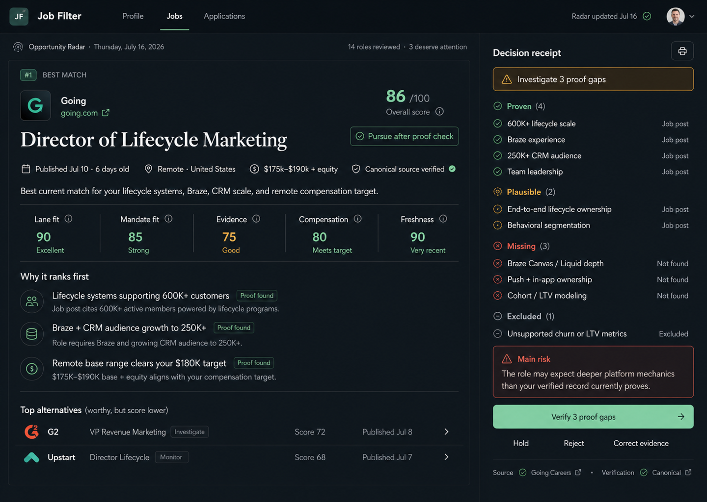
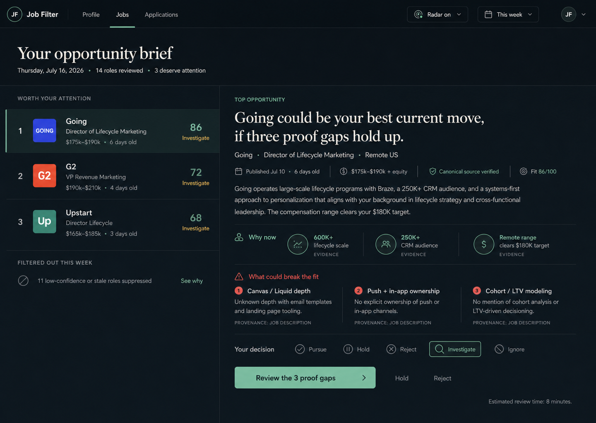
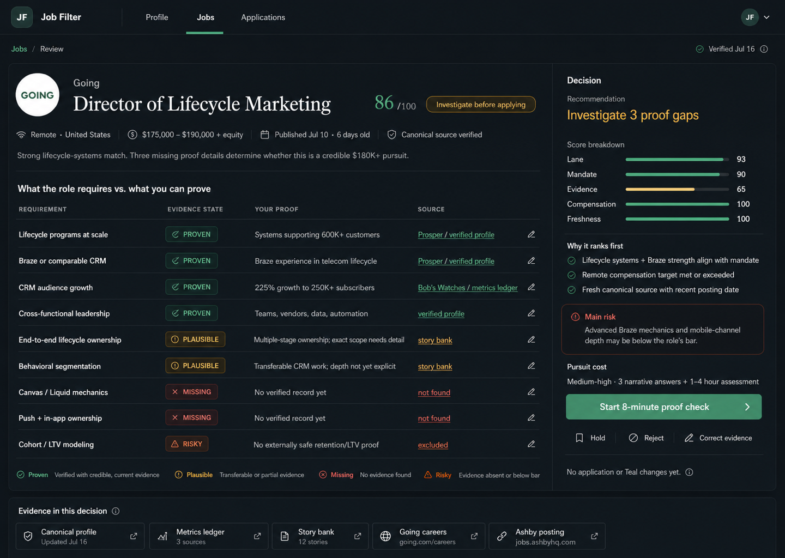

# Primary Experience Selection And Hybrid Specification

Date: 2026-07-17
Status: product direction selected; implementation not yet authorized

## Leader Decision

Use **Option 2, Radar Brief, as one dated result of an Opportunity Radar**. Use **Option 3, Proof Lens, as the individual Opportunity Review**. Retire **Option 1 as a whole screen** and reuse only its ranked-row and compact Decision Receipt components.

The current concepts do not include a Radar Setup screen or a Pursuit Application screen. Both require new designs. The complete route and interaction model is defined in [Platform Screen System And Interaction Contract](platform-screen-system-and-interaction-contract-2026-07-17.md).

This is a product-level selection, not an attempt to merge all three screens into one. Progressive disclosure is the core interaction rule:

`Radar Setup -> Radar Brief -> Opportunity Review -> user decision -> native Pursuit -> exact external approval`

## Why This Wins

Option 2 answers the recurring subscription question most directly: `Did the Radar find anything worth my attention, and why?` It has the clearest dated-brief hierarchy, strongest weekly-return behavior, lowest cognitive load, and best no-action-week potential.

Option 3 answers the trust question most directly: `What does the role require, what can I actually prove, and where did that proof come from?` It belongs one level deeper, where density is earned by user intent.

Option 1 contains the best compact recommendation and risk summary, but its full layout is too dense for a collection or brief and its source labels currently confuse employer requirements with candidate proof.

## Evidence Screens

### 1. Option 1: Decision Desk

Health: **useful component source, not selected as a whole screen**.

Strengths:

- strongest compact recommendation, main risk, alternatives, and one next action,
- visible proven, plausible, missing, and excluded states,
- contains useful visual treatment for a single `Pursue`, `Watch`, or `Pass` user-decision group.

Risks:

- dense for a first or recurring screen,
- job-post labels are unsafe as candidate-proof lineage,
- score strips imply more precision than the evidence supports,
- mobile stacking would create a very long first screen.

### 2. Option 2: Radar Brief

Health: **selected as the dated Radar Brief after required corrections**.

Strengths:

- clearest recurring habit and weekly value,
- makes restraint visible by showing reviewed, surfaced, and suppressed roles,
- easiest to understand without training,
- simplest master-detail pattern to reflow responsively,
- supports both passive monitoring and active search.

Risks:

- insufficient proof lineage on its own,
- must distinguish the system recommendation from the user's saved decision,
- needs an explicit no-opportunity state,
- current time, score, compensation, and proof copy are stale or unsafe.

### 3. Option 3: Proof Lens

Health: **selected as the Review detail after responsive simplification**.

Strengths:

- strongest requirement-to-proof-to-source mapping,
- clearest truth-state separation,
- visible correction controls, pursuit cost, and no-external-action state,
- strongest trust and explainability foundation.

Risks:

- too dense for the Radar Brief,
- wide table is a mobile and screen-reader risk,
- icon-only actions are not sufficient,
- score values still imply false certainty.

## Required Corrections Before New Mockups Or Code

1. Going score must be `85/100`.
2. Compensation must read `Starts at $175,000 plus equity; public upper bound unknown`.
3. Recommendation must be `Investigate` until proof validation supports `Pursue`.
4. Remove public fixed-duration statements, including `8-minute review`, `Start 8-minute proof check`, and similar promises.
5. Replace job-post candidate proof labels with approved Profile Fact versions and exact source lineage.
6. Add canonical-employer, duplicate, availability, freshness-check, and unresolved-hard-gate states.
7. Show proof used, missing, risky, and excluded explicitly.
8. Add Career Baseline comparison, career economics, strategic upside, career capital, future optionality, and total pursuit effort without reducing them to one opaque score.
9. Use text plus icons for state and correction controls.
10. Render the system recommendation as read-only status, not as a decision button.
11. Show one user-decision group once: `Pursue`, `Watch`, `Pass`.
12. Use `Review 4 proof questions` for the current Going fixture workflow action; do not repeat decisions on the proof surface.
13. Preserve a clear statement that no application, message, employer-site action, or other external action has occurred.

## Core Screen Contract

### Opportunity Radar

`Opportunity Radar` is the saved monitor definition: Role Lanes, Career Baseline, compensation, logistics, company preferences, sources, freshness rules, hard constraints, cadence, and notifications.

`Radar Setup` edits that definition. `Radar Brief` is one dated result. `Opportunities` is the canonical collection. `Review` is one job's detail. These are separate objects and surfaces.

### Radar Brief

The user should understand at a glance:

- whether anything deserves attention,
- which opportunity ranks first,
- why it may be materially better than the current Career Baseline,
- the main issue that could invalidate it,
- the single next action.

Required states:

- material-opportunity week,
- no opportunity worth attention,
- active-search priorities and deadlines,
- learning after a correction or decision,
- loading, partial-source, stale-source, conflict, and error.

### Review / Proof

The user should understand:

- each material role requirement,
- whether candidate evidence is proven, plausible, missing, risky, or excluded,
- the exact approved source behind any proven item,
- what changed the recommendation,
- what the user can correct,
- what effort and uncertainty remain.

On narrow screens, evidence rows become expandable cards. Recommendation, main risk, and next action appear first; evidence details follow; alternatives appear after the decision content.

## Light And Dark Theme Contract

- Offer `System`, `Light`, and `Dark` in Settings.
- Default to `System` for a new account.
- Persist the choice across sessions and signed-in devices when practical.
- Keep semantic colors, hierarchy, component dimensions, and information order consistent across themes.
- Dark mode may use the current mineral and restrained mint direction.
- Light mode should use the existing warm-neutral and forest-accent language, not a simple color inversion.
- Both themes must pass contrast, focus, hover, selected, disabled, success, warning, risk, and error checks.
- Theme choice must not encode or hide evidence state.

## Time-Claim Policy

Do not place fixed completion-time claims in product or marketing copy by default.

A time estimate may appear only when:

1. it is based on recent measured behavior for the same workflow,
2. the calculation and sample are defined,
3. it is labeled as an estimate rather than a promise,
4. the interface remains correct if the estimate is removed,
5. the estimate is recalibrated as capability changes.

Internal operating targets and user-research session guides may retain time budgets because they are planning controls, not customer promises.

## Accessibility And Evidence Limits

The current audit is based on 1440 by 1024 static images. It does not prove:

- keyboard order or complete keyboard access,
- visible focus,
- contrast ratios,
- screen-reader names, roles, states, or relationships,
- touch target sizes,
- responsive reflow,
- reduced-motion behavior,
- loading, error, conflict, partial, and empty-state comprehension.

These are implementation acceptance criteria, not optional polish.

## Audit Steps And Health

1. **Ground source screenshots:** complete and healthy.
2. **Evaluate recurring subscription value:** Option 2 selected for the Radar Brief.
3. **Evaluate decision completeness:** Option 1 retained only as components.
4. **Evaluate proof trust and lineage:** Option 3 selected for Opportunity Review.
5. **Apply Matt's theme and time-copy feedback:** implemented in light, dark, and system modes with no fixed duration promise.
6. **Validate responsive and accessibility behavior:** passed for private prototype testing at 320, 390, 768, and 1280 pixels; production certification remains open.
7. **Run user comprehension and no-action-week tests:** prototype states are implemented; moderated user testing remains pending.

## Implemented Design Deliverable

The working prototype now contains one refined product family with:

- a new Radar Setup screen,
- a corrected Radar Brief derived from Option 2,
- a corrected Opportunity Review derived from Option 3,
- a new native Pursuit Application and exact-approval screen,
- material-opportunity and honest no-opportunity states,
- desktop and narrow-screen behavior in light and dark themes,
- corrected Going evidence,
- no fixed duration promises.

The interaction contract is non-negotiable: recommendation is read-only; `Pursue`, `Watch`, and `Pass` appear once; proof work is a workflow action; external approval is separate and exact. Teal does not appear in customer-facing product copy or architecture.
