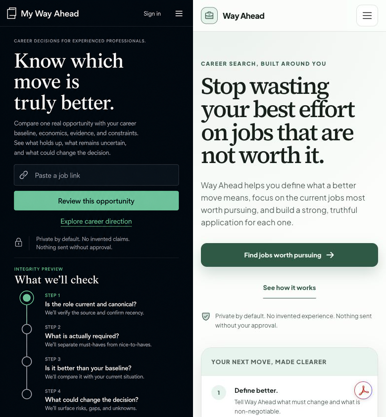
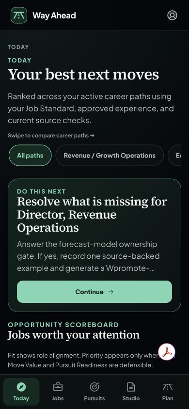
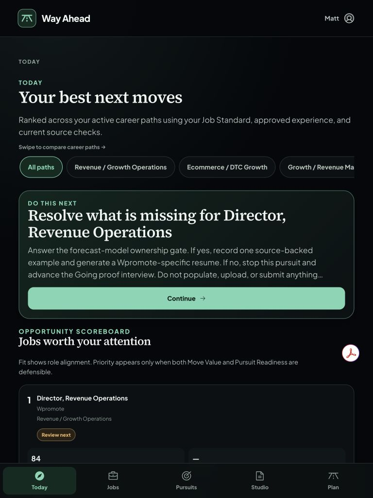
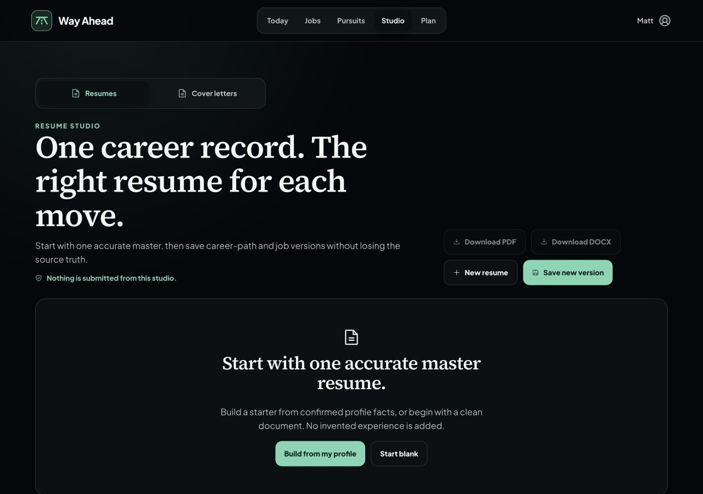
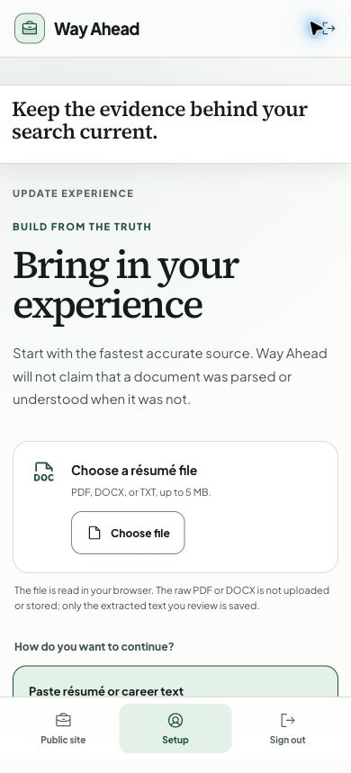

# Independent visual QA verdict

## Comparison input

- Left: `selected-executive-evidence-timeline.png`, scaled from 853 x 1844 to 390 x 844 without cropping.
- Right: `browser-evidence/public-mobile-light-390x844.png`, captured at 390 x 844.
- The reference is evaluated as design-language evidence. The rejected timeline information architecture is not a restoration requirement.

## Corrected evidence reviewed

Interaction, target-size, structure, and measured contrast evidence was also reviewed in `accessibility-and-interaction-receipt-2026-07-23.md`.

## Final verdict

**PASS for the reviewed private-alpha visual slice.**

The corrected build preserves the reference's strongest design language: editorial serif decision statements, restrained sans-serif support copy, a disciplined mint/green action color, thin borders, explicit privacy language, and calm spacing. It also correctly moves beyond the rejected timeline pattern. Today, onboarding, and Studio now use discrete, task-focused surfaces that are easier to compartmentalize.

No material visual blocker remains in the supplied mobile, tablet, desktop, theme, onboarding, and interaction evidence. This pass is not a claim of full WCAG conformance or a substitute for a production-browser smoke test after deployment.

## Previous conditions adjudicated

| Previous condition | Final judgment | Evidence and remaining caveat |
| --- | --- | --- |
| 1. Surface the scoreboard sooner on Today mobile | **Pass with minor caveat** | The corrected 390-pixel screen now exposes the scoreboard heading in the initial viewport and keeps the next action clearly primary. The first numeric row remains just below the fixed navigation, so a zero-scroll score is not literally achieved. This is a polish opportunity, not an alpha blocker. Avoid the awkward `Wpromote-…` line ending in a later copy-density pass. |
| 2. Make additional career paths discoverable at mobile and tablet widths | **Pass** | Both corrected Today captures say “Swipe to compare career paths →” and intentionally expose a partial next chip. The 768-pixel capture also shows the first ranked opportunity and score without horizontal body overflow. |
| 3. Provide authenticated desktop evidence | **Pass for responsive coverage** | The 1280 x 900 Resume Studio capture proves the authenticated shell, top navigation, Studio controls, empty state, margins, and line lengths render without collision or overflow. A duplicate desktop Today capture would improve the Board packet, but mobile and tablet already prove that surface and its data hierarchy. |
| 4. Record measured contrast and keyboard/focus evidence | **Pass** | The receipt records sampled light/dark ratios above the relevant thresholds, labeled controls, skip-link behavior, Escape/focus return, Back/Forward behavior, and touch targets of at least 46 pixels in the tested slice. It properly avoids claiming full WCAG conformance. |
| 5. Resolve or qualify the Acrobat overlay | **Pass as an evidence qualification** | The red Acrobat bubble remains visible in some authenticated captures, but the receipt explicitly identifies it as a Chrome extension overlay and separates its console errors from application code. It is not Way Ahead UI. Clean production screenshots would still be preferable. |

## Remaining findings

- **No material visual finding blocks the private-alpha checkpoint.**
- The onboarding image named `390x844` is actually 390 x 859 pixels. The 15-pixel evidence-label mismatch does not affect the responsive judgment, but the Board packet should state the measured dimensions or rename the file.
- The mobile Today summary uses line clamping to reach the scoreboard sooner. A later polish pass should shorten the copy at the source so it ends on a complete phrase instead of a hyphenated ellipsis.
- Screenshots cannot prove every focus state, screen-reader announcement, browser engine, or interaction state. Those limits are correctly bounded by the separate receipt.

## Files created

- `visual-comparison-reference-vs-current-mobile-390x844.png`
- `visual-verdict-reference-vs-current-2026-07-23.md`
