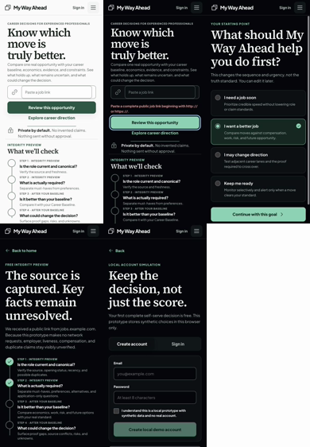
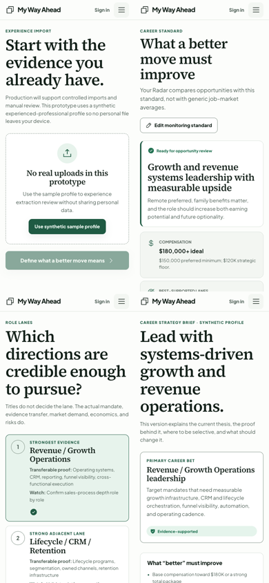
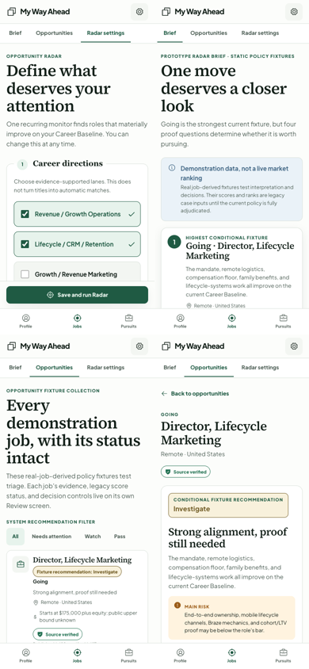
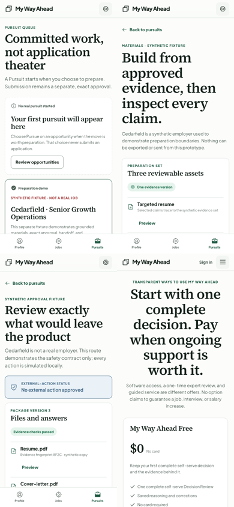
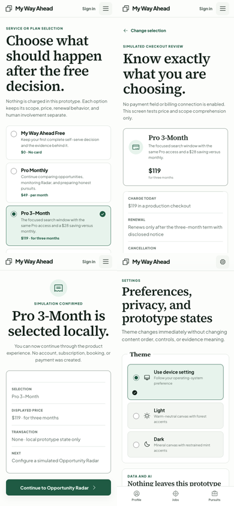

# My Way Ahead Prototype Experience Audit

**Audit date:** 2026-07-19
**Viewport inspected:** 390 by 844 CSS pixels
**Build:** Local synthetic prototype at `http://localhost:3002`
**Decision:** Freeze this build as the comparison baseline. Do not treat it as beta-ready.

## Executive verdict

The prototype has a strong trust architecture, a distinctive editorial visual direction, and a promising core idea: help a person decide whether a job is genuinely better before spending time pursuing it. The current experience does not yet make that value easy enough to understand or use.

The main problem is structural, not cosmetic. The product repeatedly asks the user to understand the intelligence system when the screen should help the user answer one ordinary question. Dense copy, tight spacing, repeated cards, internal terminology, and mixed commercial choices make the experience feel more demanding than the job decision it is meant to simplify.

Nine P1 issues block another founder-quality or external beta handoff. The job-entry field has a confirmed CSS defect. The homepage does not clearly explain the product. The live-role CTA does not deliver the promised next step. Onboarding is Matt-specific and lacks orientation. Pricing combines unlike purchases. The opportunity review exposes too much internal machinery before the decision. These problems survived the current automated test suite, which proves that functional checks and experience quality need separate acceptance gates.

## Screenshot evidence

The following contact sheets contain screenshots captured from the current build during this audit. Individual screen files are in this folder.

### 1. Public entry and account gate

### 2. Onboarding and career strategy

### 3. Radar and opportunity decisions

### 4. Pursuit and pricing transition

### 5. Plan selection, checkout, confirmation, and settings

## Confirmed P1 release blockers

| # | Finding | Evidence and root cause | Required correction |
|---:|---|---|---|
| 1 | Job-entry field renders as a box inside a box | The outer `.capture-input` draws a border. The global input selector at `app/globals.css:460` also draws a border and outranks the attempted reset at `app/globals.css:2526`. The invalid state makes the defect more obvious. | Use one dedicated field boundary, a visible label, one focus ring, 52 to 56 pixel control height, resilient long-URL wrapping, and explicit URL-or-description handling. |
| 2 | Mobile spacing was compressed to fit a reference image | Mobile rules use 4 pixel heading gaps, 4 pixel secondary-action and trust gaps, 6 pixel timeline spacing, 0.60rem kicker text, and 0.75rem timeline copy at `app/globals.css:4012-4120`. | Restore a readable 4/8 spacing system and allow the page to scroll. Do not use above-the-fold density as the primary success measure. |
| 3 | Homepage value is too abstract | The hero leads with "Know which move is truly better" and terms such as career baseline, economics, evidence, and constraints. It does not plainly say find jobs, compare them, explain fit, and help with the next step. | Lead with the user outcome in plain language, show how the product works, demonstrate one decision, and move trust mechanics below the initial promise. |
| 4 | Consumer copy reads like an internal policy system | Terms such as canonical, mandate, thesis, optionality, payload, fixture, adjudicated, suppressed, and fingerprint appear in the primary journey. | Create a two-layer vocabulary: ordinary language first, technical provenance behind "Why we think this" or "View source details." |
| 5 | The first CTA breaks its promise | Home says "Review this opportunity," but a submitted job first opens Choose Mode. The route wiring is visible at `app/MyWayAheadPrototype.tsx:1288-1291`. | A job-link user should receive the Integrity Preview immediately, then save or sign up, build the minimum profile, and receive the complete comparison. The exploratory branch may begin with the current goal. |
| 6 | Onboarding lacks orientation and edit control | There is no persistent progress model or consistent Back/Edit path. The Baseline and role directions are largely presented as conclusions. | Add a progress shell, autosave, Back/Edit access, explicit confirmation, and a route-appropriate first-value preview. |
| 7 | The data model is Matt-specific | Compensation, role lanes, remote preference, and evidence fixtures reflect case-study zero. Hourly earnings, tips, schedule, commute, benefits eligibility, and different experience levels are not represented. | Keep Matt as the first case, but make Baseline and career-direction templates persona-aware and editable. |
| 8 | Pricing mixes different businesses and fulfillment paths | Free software, recurring software, one-time review, and guided service are peers. Monthly and three-month terms are separate plans. Free uses Checkout. Every confirmation routes to Radar. | Separate software access from human help. Treat billing term as a choice within one software offer. Give each purchase or free selection a truthful, distinct next step. |
| 9 | Opportunity Review overloads the first decision layer | The ingredients are strong, but recommendation, status, risks, scores, extraction, provenance, requirements, benefits, economics, and application gates compete for attention. | First answer: Is it worth my time? Why? What could change the answer? What should I do next? Put source and policy detail one layer deeper. |

## Important P2 findings

- Critical mobile body and helper copy is frequently smaller than a comfortable reading floor.
- Card-after-card presentation makes nearly every section appear equally important.
- The internal `100dvh` scroll container and smooth route scroll create a visible rail and a brief disorienting transition from a deeply scrolled screen to the next route.
- The job-entry label is screen-reader-only even though a visible label would improve comprehension for everyone.
- "Pursuits," "Brief," "Preparation gates," and similar labels require unnecessary learning.
- Public navigation lacks How It Works, Trust, FAQ, Privacy, Terms, Contact, and accessibility paths.
- Prototype scenario controls and test fixtures are mixed into user Settings.
- Pricing does not yet explain billing timing, renewal, cancellation, scope, limits, human involvement, or the reason for a longer term.
- The brand mark interaction appears smaller than a 44 by 44 pixel touch target.
- A missing favicon produces the only browser console error observed in the current route sweep.

## Screen-by-screen health

| Step | Screen | Health | Main reason |
|---:|---|---|---|
| 1 | Home | Poor | Attractive direction, but weak value clarity, cramped rhythm, and a broken job-entry control |
| 2 | Choose Mode | Fair | Useful segmentation, but wrong placement for users who already pasted a role and too much jargon |
| 3 | Integrity Preview | Fair | Trustworthy behavior, but technical language and dense small copy dominate |
| 4 | Account | Fair | The local-only boundary is honest, but account creation interrupts value and prototype copy dominates |
| 5 | Experience Import | Fair | Good idea, but no realistic editable import path and too much proof-system vocabulary |
| 6 | Career Baseline | Fair/Poor | Essential concept, but presented as Matt's answer instead of created with a new user |
| 7 | Role Directions | Fair/Poor | Useful comparison, but hard-coded, exclusive-selection behavior and specialist language narrow usefulness |
| 8 | Career Strategy Brief | Fair | Valuable synthesis, but dense and action semantics are unclear |
| 9 | Radar Setup | Good/Fair | Logical grouping, but too much copy and technical safeguard language |
| 10 | Radar Brief | Poor for consumers | Internal fixture, queue, suppression, and policy language bury the result |
| 11 | Opportunities | Fair | Scannable foundation, but verbose statuses and weak sorting or filtering hierarchy |
| 12 | Opportunity Review | Good foundation | Best product concept, but overloaded and too technically worded |
| 13 | Pursuit Queue | Fair | Safety logic is sound, but labels and internal demo content are alienating |
| 14 | Materials | Good/Fair | Logical asset structure, but needs clearer edit, completion, and provenance states |
| 15 | Application Review | Strong safety, weak UX | Exact approval is excellent; payload and fingerprint detail should be progressive |
| 16 | Pricing | Poor | Confused offer taxonomy and unclear differentiation |
| 17 | Plan Selection | Poor | Repeats unlike choices and defaults toward a longer prepaid term |
| 18 | Checkout | Poor | One generic checkout cannot truthfully serve Free, subscription, review, and coaching |
| 19 | Confirmation | Poor | Different selections receive the same next step |
| 20 | Settings | Fair | Theme control is useful; user, privacy, and internal demo controls are mixed |

## Recommended mobile system values

| Element | Target |
|---|---|
| Page padding | 20px at 320px; 24px from 390px upward |
| Page top spacing | 32 to 40px |
| Major section spacing | 48 to 64px |
| Product module spacing | 32px |
| Card gap | 16px |
| Card padding | 20px; 24px for decision-critical content |
| Heading to body | 12 to 16px |
| Body to primary action | 24px |
| Body copy | 16px with 1.55 to 1.65 line height |
| Secondary copy | 14px |
| Metadata | 12px minimum; never 9.6px for consumer-facing content |
| Mobile H1 | 40 to 48px with 1.03 to 1.08 line height |
| Mobile H2 | 28 to 32px |
| Controls | 52 to 56px preferred; 44px minimum |
| Timeline | 32px node, 16px column gap, 28 to 32px between steps |
| Paragraph width | Approximately 45 to 65 characters |

## Plain-language homepage direction

**Kicker:** A smarter way to choose your next job
**Headline:** Find better jobs. Know which ones are worth pursuing.
**Body:** Paste a job or tell us what you want next. My Way Ahead compares the pay, requirements, work style, and career growth, explains why the job may fit, and helps you take the next step.
**Visible field label:** Have a job in mind?
**Placeholder:** Paste the job posting link
**Primary action:** Check this job
**Secondary action:** Help me find better jobs
**Trust line:** Your information stays private. We never apply or contact anyone unless you approve it.

The retained connected timeline should use these questions:

1. Is the job real and still open?
2. What does the employer truly require?
3. Would it improve your pay, work, or future?
4. What needs a closer look?

## Verification performed

- Captured and inspected the full 20-step customer and commercial route set plus the Home invalid-input state at 390 by 844.
- Reproduced the job-entry nested-border defect and traced it to CSS specificity.
- Verified the live-role CTA route mismatch in source.
- Verified the generic post-confirmation route and mixed commercial flow in source.
- Ran `npm test`: typecheck, production build, and 8 rendered-HTML tests passed.
- Ran `npm run lint`: passed.
- Reviewed browser console messages: one missing `favicon.ico` error; no warning messages in the route sweep.

The passing automated tests are not a beta-ready verdict. They cover build integrity, truth boundaries, source-kind behavior, approval binding, storage behavior, and selected shell safeguards. They do not currently detect copy comprehension, spacing, pricing comprehension, route-promise mismatch, mobile interaction burden, or actual assistive-technology performance.

## Evidence limits

This audit used synthetic fixture data and a controlled local browser. It did not include real payment, live source ingestion, production authentication, real resume import, human fulfillment, external messages, a real iPhone keyboard, VoiceOver, TalkBack, or moderated external users. Accessibility observations from screenshots and DOM inspection are findings and test requirements, not a claim of full WCAG conformance.
